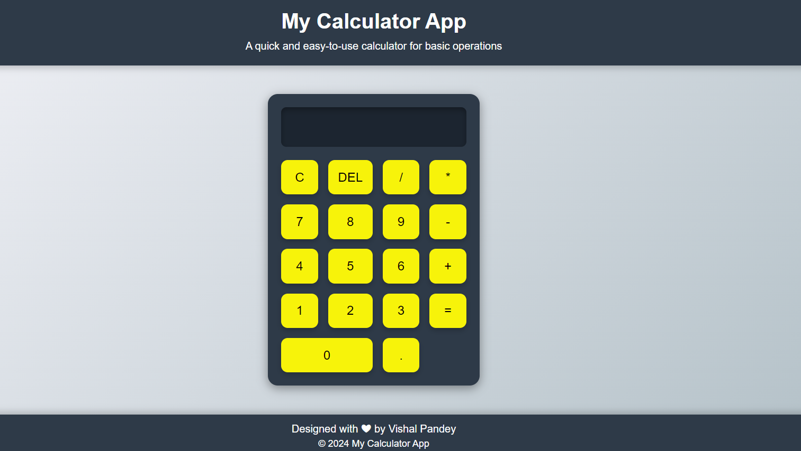

<div align="center">
  <h2 align="center">A CALCULATOR APPLICATION</h2>


  <a href="https://vishalp-08.github.io/Calculator_App/"><strong>➥ Live Demo</strong></a>

</div>

<br />

### Demo Screeshots



### Prerequisites

Before you begin, ensure you have met the following requirements:

* [Git](https://git-scm.com/downloads "Download Git") must be installed on your operating system.

### Run Locally

To run **CALCULATOR APPLICATION** locally, run this command on your git bash:

Linux and macOS:

```bash
sudo git clone https://github.com/vishalP-08/Calculator_App.git
```

Windows:

```bash
git clone https://github.com/vishalP-08/Calculator_App.git
```

### Contact

If you want to contact with me you can reach me at [WhatsApp](https://wa.me/917992199075).
